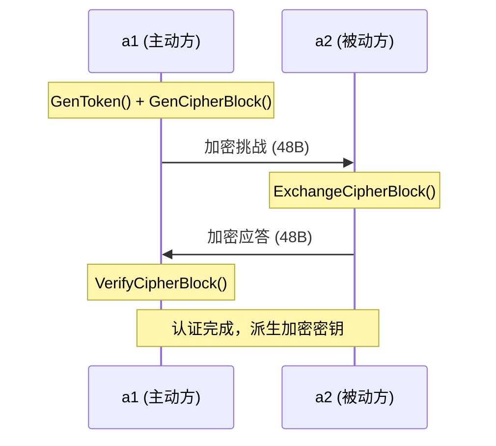

# Taa 认证流程

## 概述

Taa (Tunnel Authentication Algorithm) 实现了基于 AES-128 + HMAC-SHA256 的双向认证协议，核心思想来自 TLS 的 Encrypt-then-MAC 模式。

## 关键数据结构

### authToken (16 bytes)

```
┌─────────────────┬─────────────────┐
│    challenge    │    timestamp    │
│    (uint64)     │    (uint64)     │
└─────────────────┴─────────────────┘
```

### TaaBlock (48 bytes)

```
┌─────────────────────────┬─────────────────────────────┐
│   AES 加密的 Token       │      HMAC-SHA256 签名       │
│       (16 bytes)         │        (32 bytes)           │
└─────────────────────────┴─────────────────────────────┘
```

### Taa 结构体

```go
type Taa struct {
    block cipher.Block // AES-128 加密块
    mac   hash.Hash    // HMAC-SHA256
    token authToken    // 本地认证状态
}
```

## 完整握手流程


