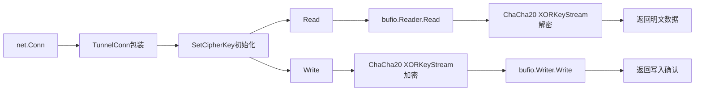

# TunnelConn 数据流

## 概述

TunnelConn 包装 net.Conn，实现 ChaCha20 加解密的读写接口。

## 数据结构

```
┌─────────────────────────────────────┐
│           TunnelConn                │
├─────────────────────────────────────┤
│ net.Conn         - 底层 TCP 连接    │
│ *bufio.Reader    - 缓冲读取         │
│ *bufio.Writer    - 缓冲写入         │
│ *chacha20.Cipher - 加密器           │
│ *chacha20.Cipher - 解密器           │
└─────────────────────────────────────┘
```

## 读写流程



**前提条件**: 必须调用 `SetCipherKey(key)` 初始化 ChaCha20 cipher 后，才能进行加解密读写。

## 关键设计

- **Nonce**: 全零 nonce，同一 cipher 实例内 XORKeyStream 自动推进计数器
- **缓冲区**: Reader/Writer 大小为 `TunnelPacketSize*2`
