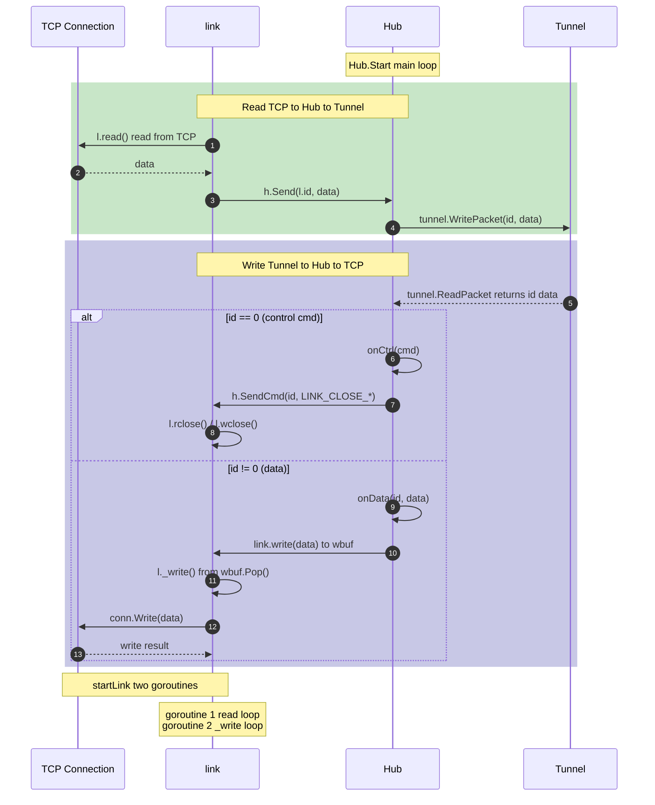

# link 处理

## 架构图

## 核心职责

一条多路复用链路，绑定一个 `link id`（uint16），对应隧道远端的一个逻辑连接。

## 数据流

| 方向 | 路径 |
|------|------|
| Tunnel → Conn | `Tunnel.ReadPacket()` → `link.write(data)` → `wbuf.Put()` → `link._write()` → `conn.Write()` |
| Conn → Tunnel | `link.read()` →  `conn.Read()` → `h.Send(id, data)` → `Tunnel.WritePacket()` |

## 方法说明

| 方法 | 作用 |
|------|------|
| `read()` | 从 `conn` 读取数据，返回 `[]byte` |
| `write(b)` | 将数据写入 `wbuf` 缓冲区 |
| `_write()` | 后台 goroutine，从 `wbuf` 消费数据写入 `conn` |
| `rclose()` | 停止读取，设置 `rerr = errPeerClosed` |
| `wclose()` | 停止写入，关闭 `wbuf` |
| `aclose()` | 完全关闭（调用 rclose + wclose） |

## 状态字段

| 字段 | 类型 | 说明 |
|------|------|------|
| `id` | uint16 | 链路唯一标识 |
| `conn` | *net.TCPConn | 底层 TCP 连接 |
| `wbuf` | *Buffer | 写缓冲区 |
| `lock` | sync.Mutex | 保护 `rerr` |
| `rerr` | error | 读取关闭错误 |

## 与 Hub 的关系

- Hub 通过 `createLink(id)` 创建 link
- Hub 通过 `getLink(id)` 查找 link
- Hub 处理控制命令（LINK_CREATE/LINK_CLOSE）来管理 link 生命周期
- `startLink()` 启动 link 的读写 goroutine
